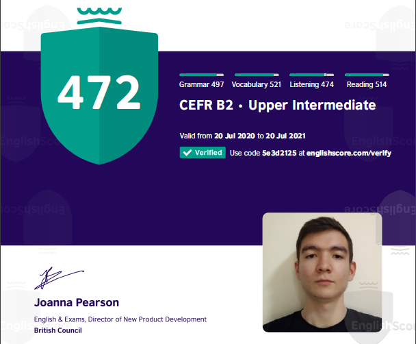

# Ilnar Esanov

*****

## Junior Frontend Developer

*****

## Contact information:

  **Phone**: +998 97 152 00 27

  **E-mail**: ilnaresanov2002@gmail.com

  **[Telegram ](https://t.me/walker_027)**

  **[LinkedIn ](https://www.linkedin.com/in/ilnar-esanov-24465720b/)**

*****

## Briefly about myself:
Currently I'm a student of Uzbekistan State World Languages University in Tashkent. A year ago I decided to try myself in Frontend Developing, because I like to do this kind of staff, such as crating web-sites and applications. 

First, I've already finished one good course on HTML5 and CSS3 on Udemy, that formed the basis for my study. With a help of it, I could manage to create a modern HTML and CSS based web-site by myself! 

Then, I also started to learn Javascript with a help of course on the same platform which is now in progress. I've already studied some basics of JS and I could even write some not sophisticated algorithms!

I believe that in the not so far future my skills will lead me through the path of becoming a proficient JavaScript Software Engineer!

*****

## Skills and Proficiency:

* HTML5, CSS3, Working with layouts
* JavaScript Basics
* Git, GitHub Basics
* VS Code, Sublime
* Codewars kyu 8-7

*****

## Code Example: 
  KATA from CODEWARS: Replace items that < 5 with 0 and which are > 5 with 1

  `function fakeBin(x) {
  let tmp = "";
  for (let i = 0; i < x.length; i++) {
    if (x[i] < "5") tmp += "0";
    else if (x[i] >= "5") tmp += "1";
  }
  return tmp; }`

***** 

## Courses:

  1. Build Responsive Real-World Websites using HTML and CSS
  2. JavaScript Manual on learnjavascript.ru (in progress)
  3. The Complete JavaScript Course 2022 (in progress)
  4. JavaScript training from RS School 2022 (in progress)
  5. Book - Grocking Algorithms (in progress)

*****

## Languages:

1. Russian - Native
2. English - EILTS certificate (Overall: 6.0), B2 (according to the British Council test)

3. Uzbek - Comprehent user
4. German - Beginner
